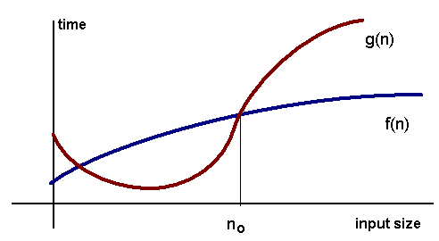
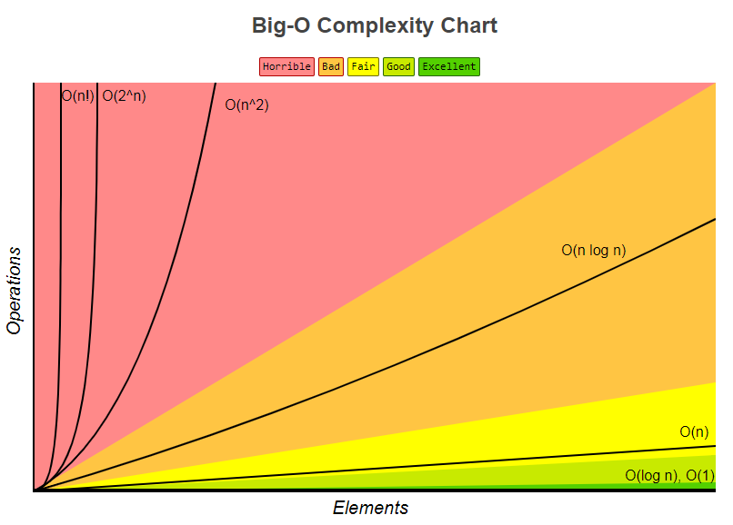

# 算法特性及大O记法 

> 本系列在[Node小栈](https://github.com/gedennis/node-tribe-blog#%E6%8E%92%E5%BA%8F%E7%AE%97%E6%B3%95)下有拷贝，以便大家提issue指正。本篇文章提issue， [请戳这](https://github.com/gedennis/node-tribe-blog/issues/7)  
> 本系列在[Node小栈](https://github.com/gedennis/node-tribe-blog#%E6%8E%92%E5%BA%8F%E7%AE%97%E6%B3%95)下有拷贝，以便大家提issue指正。本篇文章提issue， [请戳这](https://github.com/gedennis/node-tribe-blog/issues/7)  
> 本系列在[Node小栈](https://github.com/gedennis/node-tribe-blog#%E6%8E%92%E5%BA%8F%E7%AE%97%E6%B3%95)下有拷贝，以便大家提issue指正。本篇文章提issue， [请戳这](https://github.com/gedennis/node-tribe-blog/issues/7)  

## 排序算法
排序算法(Sorting algorithms)是什么？  [Wikipedia](https://en.wikipedia.org/wiki/Sorting_algorithm) 如是说:
> In computer science, a sorting algorithm is an algorithm that puts elements of a list in a certain order.

也就是说，排序算法，就是某种算法，将列表中的元素按照某种规则排序。常见的如数字大小排序、字典序排序等。本系列例子约定为从小到大的数字排序，其他的类似，关键在于思路。
### 算法特性
**1、内部排序和外部排序**  

按照数组规模的大小，排序可以分为`内部排序`和`外部排序`。  
**内部排序(internal sorting):** 全部数组都可放在内存中排序。  
**外部排序(external sorting):** 数组太大，不能全部放在内存中，部分数据在硬盘中。

本系列约定为内部排序，关于海量数据的排序，后续补充。

**2、稳定性**  
排序法的稳定性(stability): 取决于值相等的两个元素，排序之后是否保持原来的顺序。 

**3、比较排序和非比较排序**  
**比较排序(comparison sort):**  
比较排序中，每一步通过比较元素大小来决定元素的位置。其复杂度由`比较次数`和`交换次数`来决定。比较排序比较好实现，但是时间复杂度无法突破` O(nlogn)`。证明过程，可以参考这篇[文章](https://brilliant.org/wiki/sorting-algorithms/)。  

**非比较排序(non-comparison sort):**  
非比较排序，如桶排序，不通过比较，后续将会讲解。这类算法可以突破` O(nlogn)`。

排序算法有很多种，每一种都各自有自己的优点缺点和不同的应用场景，没有一种排序是绝对完美的。如何评价一个算法的优劣呢，我们通过`算法复杂度`来衡量。

## 算法复杂度
**算法复杂度(complexity)**，可以从`时间复杂度`和`空间复杂度`两个维度来考虑。  
空间复杂度，是指算法所需要的额外的存储单元。目前的硬件条件，这一块通常可以不考虑了。算法优化，更多是来优化算法的时间。

> 下面将介绍如何来估算时间复杂度。下面的介绍的方法，目前只够勉强说服我自己。如果觉得不想了解这个理论，可以直接记住下面的结论。如果觉得讲得不是那么容易懂，可以参考别的资料仔细研究。 

### 时间复杂度
如果一个列表的大小为n，则算法耗费的时间T(n)。但是由于机器、CPU等的不同，同一个算法执行的时间可能都不一样。所以通常不是按耗费的时间来计算，而是用某个算法实现的`指令执行的次数`，来衡量时间复杂度。如下面这个程序：
```javascript
for( i = 0; i < n; i++)   // i = 0; 执行1次
       			  // i < n; 执行n+1次
			  // i++    执行n次
  sum = sum + i;          //    执行n次
  
// 总次数f(n) = 1 + n+1 + n +n = 3n+2
```
通过上面计数操作数的方法，显得很麻烦。所以通常是通过一个函数来估算，确保它是算法操作数f(n)的上界。这种方法就是`大O记法`。
### 大O记法
对于单调函数 f(n) 和 g(n), n为正整数，如果存在常数c > 0, n<sub>0</sub> > 0,且
```math
f(n) ≤ c * g(n), n ≥ n0
```
则我们称

```math
f(n) = O(g(n)) 
```
如下图所示。


简单来说，就是当n→∞时，f(n)的增长率不大于g(n),也就是说g(n)时f(n)的上界。
在这里，f(n)就是算法的指令操作数，而g(n)就是我们估算的复杂度上界。
它还有两个特性。
```
O(g1(N)) + O(g2(N)) = max(O(g1(N)), O(g2(N)))
O(g1(N)) * O(g2(N)) = O(g1(N) * g2(N))
```
所以，上面程序的时间复杂度是:

```
f(n) = 3n+1 = O(1) + O(n) + O(n) + O(n) = O(n)
```
- 常数时间 O(1)  
`常数时间(constant time)`,算法的执行时间和列表大小无关。
- 线性时间 O(n)  
`线性时间(linear time)`, 算法执行时间和列表大小成正比。
- 对数时间 O(logn)  
`对数时间(logarithmic time)`, 稍微显得难理解一点。不过如果你了解对数，其实也很简单。例如二分查找，每一次查找都会去掉一半的元素，但最后一次元素个数就是1。假设数组大小为n, 要经过x轮查找，则

```math
    n * (1/2)^x = 1
```
则

```math
    x = log_{2}n
```
logn是简写，一般忽略底数。
- 二次项时间 O(n<sup>2</sup>)  
`二次项时间(quadratic time)`, 通常是两层循环的算法。

### 简易估算方法
对于一个算法的时间复杂度，根据以上理论，大体按下面的步骤来估算复杂度。 
以这个程序为例：
```
sum = 0;            
for( i = 0; i < n; i++)
    for( j = i; j < n; j++)
        sum++;
```
**1. 忽略简单语句**  
对于简单复杂语句，它执行次数是一个常数，复杂度为O(1)。如果还存在循环，O(1)对结果不影响。

**2. 关注循环语句**  
对于循环语句，要认真分析其循环执行的次数。例子中，外层循环要执行 n 次，内层循环要
```
    n + (n-1) + ... + 2 + 1 = (n + 1)/2
```
所以总次数T(n)为
```math
    T(n) = n * (n+1)/2 = 1/2*n^2 + 1/2*n
```
**3. 忽略常数项，保留高次项**  
对于一个多项式，当n→∞时，完全由最高项次决定。所以
```math
    T(n) = O(1/2*n^2 + 1/2*n) = O(n^2 + n) = O(n^2)
```

对于有的程序，复杂度还是很不好计算。所以要多练习，写一个程序之后，自己主动去算一下它的复杂度，慢慢就熟练了。

### 算法评价
对于排序算法，一个算法的执行性能，和输入的数据有很大的关系。对于某些特定的数据，某些算法的效率很高，但通常算法的性能又很低。所以通常存在：
- 最优时间复杂度：某些数据，执行的次数最少
- 最差时间复杂度：某些数据，执行的次数最多
- 平均时间复杂度：平均需要执行的次数

通常还是以平均时间复杂度，来衡量算法。例如冒泡排序，当数组元素有序时，最优时间复杂度为O(n)。当逆序是，为O(n<sup>2</sup>)。平均还是O(n<sup>2</sup>)。算法复杂度的优劣，可以参考此图：


## 总结
本章节主要介绍了一下排序算法的类型，以及如果通过大O记法来评价一个算法。对于如何计算算法的时间复杂度，很多人都感觉很头疼。我给的建议是，按照上面的步骤多练习，多去主动算程序的时间复杂度。这样慢慢自己就会掌握技巧，并且提醒自己保证自己程序的执行效率。共勉！

## 资源与参考
[1] [About the #sorting-algorithms series](http://blog.benoitvallon.com/sorting-algorithms-in-javascript/sorting-algorithms-in-javascript/)  
[2] [凯耐基梅隆大学数据结构与算法-排序算法](https://www.cs.cmu.edu/~adamchik/15-121/lectures/Sorting%20Algorithms/sorting.html)  
[3] [CMU algorithm complexity](https://www.cs.cmu.edu/~adamchik/15-121/lectures/Algorithmic%20Complexity/complexity.html)   
[4] [Big O cheat sheet](bigocheatsheet.com)  
[5] [You need to understand Big O notation, now](https://hackernoon.com/you-need-to-understand-big-o-notation-now-4ada3d2ec93a) 
